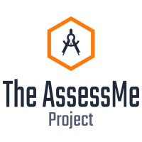

<h1 style="text-align: center;"><span style="font-weight:bold">AssessMe</span></h1>

&nbsp;&nbsp;&nbsp;&nbsp;&nbsp;&nbsp;&nbsp;&nbsp;&nbsp;&nbsp;&nbsp;&nbsp;&nbsp;&nbsp;&nbsp;&nbsp;
&nbsp;&nbsp;&nbsp;&nbsp;&nbsp;&nbsp;&nbsp;&nbsp;&nbsp;&nbsp;&nbsp;&nbsp;&nbsp;&nbsp;&nbsp;&nbsp;
[](https://python.org)
[](https://djangoproject.com)
[](https://circleci.com/gh/MarvinKweyu/AssessMe)

 
[](http://hits.dwyl.com/MarvinKweyu/AssessMe)


<p align="center">
  <!-- <b>AssessMe</b><br> -->
  <a href="https://assessme-project.herokuapp.com/">AssessMe Live</a> |
  <a href="https://hub.docker.com/r/marvinkweyu/assessme_web">Docker image</a> 
  <br><br>
  
</p>

 >An applicaition that allows teachers to create quizzes and students to
 take the quiz in relation to their interests


 # Table of Contents
 - [ Key features](#Features)

 - [ Running AssessMe locally ](#Setup)

 - [Contributions](#Contributions)


 - [License](#License)


## Features
---

- Password management
- Quiz timer
- Teacher download results option


# Setup
**Downloading the latest release.**

Knab yourself the latest release version from the page
[release page](https://github.com/MarvinKweyu/AssessMe/releases)


---
### Docker Preview

Run the following command to pull and run the latest version of the docker image:

```bash
docker run --rm marvinkweyu/assessme_web
```

### Bare metal development


Create Virtual Env and Install the requirements:

```bash
cd AssessMe
bash develop.sh
```

Finally, run the development server:

```bash
python manage.py runserver --settings=assessme.settings.dev
```

The project will be available at http://127.0.0.1:8000, Login using::

**Teacher**

username: `teacher`
password: `teacher`

**Student**

username: `student`
password: `student`

## Tests

```bash
python manage.py test --settings=assessme.settings.dev
```


## Contributions
---
Contributions are welcome.
Do remember to take a look at the project [contribution guidelines](./CONTRIBUTING.md)


## The AssessMe Contributor Board


<div align="center">
    <a href="https://github.com/MarvinKweyu/AssessMe/graphs/contributors">
        
    </a>
</div>


## License
---

This project was inspired by [suhail's](https://github.com/suhailvs/django-schools) work on the django quiz application and is released under the [MIT License](https://github.com/MarvinKweyu/AssessMe/blob/master/LICENSE).


